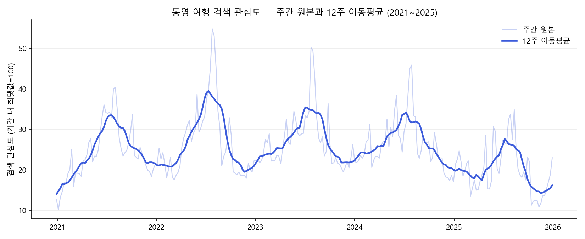
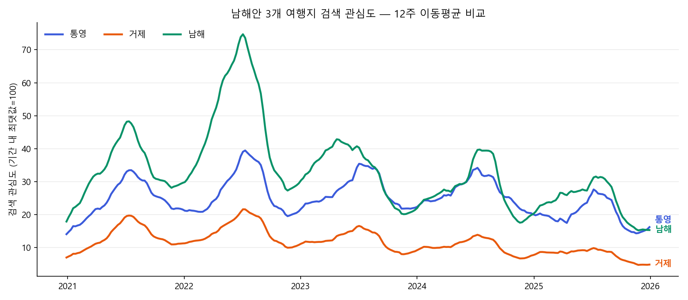
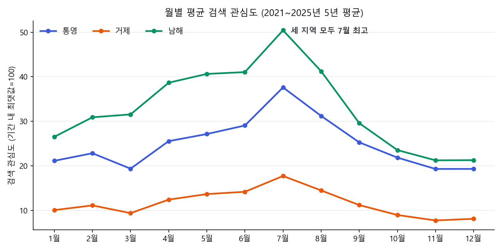
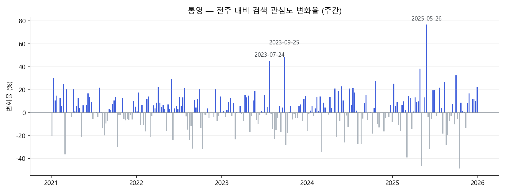

# 남해안 3개 여행지 검색 관심도 트렌드 분석 (2021~2025)

코디세이 AI 네이티브 · 미션 A3 「AI 데이터 분석: 데이터 기반 트렌드 분석」

---

## 1. 분석 주제 및 선정 이유

- 통영·거제·남해 3개 여행지의 **검색 관심도**가 5년간 어떻게 움직였는지 비교한다.
- 선정 이유: 숙박업 마케팅에서 "언제 손님이 움직이는가"는 판촉 시점을 정하는 기준이다. 검색 관심도는 실제 방문보다 앞서 나타나므로, 계절 구조와 추세를 먼저 볼 수 있다.
- 통영 단독이 아니라 인접 지역을 함께 본 이유: 통영의 수치가 오르내려도 그것이 통영만의 일인지, 남해안 전체의 흐름인지 구분해야 대응이 달라지기 때문이다.

## 2. 분석 질문

| # | 질문 | 사용 기법 |
|---|---|---|
| Q1 | 연중 언제 가장 높고 낮으며, 매년 반복되는가? | 월별 집계 |
| Q2 | 5년간 통영의 흐름은 어떤가? 거제·남해와 비교하면? | 12주 이동평균 |
| Q3 | 평소보다 급등한 주는 언제인가? | 전주 대비 변화율 |
| Q4 | 겨울 비수기 하락 폭이 통영이 다른 지역보다 큰가? | 구간별 통계 |

## 3. 데이터 설명

| 항목 | 내용 |
|---|---|
| 출처 | 네이버 데이터랩 검색어트렌드 API (NAVER API HUB) |
| 검색어 | `통영 여행`+`통영여행` / `거제 여행`+`거제여행` / `남해 여행`+`남해여행` (지역별 합산) |
| 기간 | 2021-01-01 ~ 2025-12-31 요청 → 응답은 주 단위에 맞춰 2020-12-28 ~ 2025-12-29 |
| 단위·개수 | 주간, 262주 × 3개 지역 |
| 수집일 | 2026-09-18 |
| 파일 | `data/search_trend_raw.json`(원본 응답), `data/search_trend_weekly.csv`(분석용 표) |

**값의 성격**: 실제 검색 횟수가 아니라 **조회 기간 내 최댓값을 100으로 둔 상대 지수**다. 세 지역을 한 번의 요청으로 받아 같은 기준으로 환산했다(최댓값 100은 남해 2022-07-25 주 한 곳).

**정제 결과**

- 결측치 0건, 빠진 주 0건(간격 261개 모두 7일, 모두 월요일 시작).
- 경계 주(2020-12-28, 2025-12-29)는 요청 기간과 일부만 겹치지만, 값이 앞뒤 주와 비슷해 262주 모두 유지했다. 연·월 분류는 주의 시작일 기준.
- 이상치는 IQR 기준으로 탐지해 **표시만 하고 값은 유지**했다(통영 9 / 거제 12 / 남해 18건). 후보 39건이 전부 4~8월에 몰려 있어 데이터 오류가 아니라 휴가철 실제 급증으로 판단했다.

## 4. 분석 결과 및 시각화

### 그림 1. 통영 — 주간 원본과 12주 이동평균



옅은 선이 주간 원본, 진한 선이 12주 이동평균이다. 주 단위 값은 한 주짜리 사건에도 크게 흔들리므로, 12주(약 3개월) 창으로 평균을 내어 흐름만 남겼다.

### 그림 2. 세 지역 12주 이동평균 비교



남해 > 통영 > 거제 순서가 5년 내내 유지된다. 남해는 2022년에 크게 솟았다가 내려왔고, 2024년 후반부터 통영과 거의 같은 높이가 된다.

### 그림 3. 월별 평균 (5년 평균 계절 패턴)



세 지역 모두 7월 최고, 11~12월 최저다. 3월에 한 번 꺾였다가 4월부터 다시 오른다.

### 그림 4. 통영 — 전주 대비 변화율



상위 급등 주: 2025-05-26(+77.0%), 2023-09-25(+48.4%), 2023-07-24(+45.5%), 2025-04-28(+38.4%), 2025-09-29(+32.4%). 5개 중 3개가 7~8월 성수기 밖이다.

### 참고 수치

**연도별 평균**

| 연도 | 통영 | 거제 | 남해 |
|---|---|---|---|
| 2021 | 24.4 | 13.2 | 33.6 |
| 2022 | 26.9 | 14.9 | 47.3 |
| 2023 | 27.2 | 12.1 | 33.1 |
| 2024 | 26.4 | 10.1 | 27.5 |
| 2025 | 20.2 | 7.8 | 24.1 |

**여름(7~8월) vs 겨울(12~2월)**

| 지역 | 여름 평균 | 겨울 평균 | 비수기 비율 |
|---|---|---|---|
| 통영 | 34.4 | 21.0 | 0.61 |
| 거제 | 16.1 | 9.7 | 0.60 |
| 남해 | 45.8 | 26.0 | 0.57 |

## 5. 인사이트

관찰(그래프에서 확인한 수치)과 해석(가설)을 구분해 적었다.

### 인사이트 1 — 7월 정점, 11~12월 저점의 계절 구조

- **관찰**: 5년 평균 월별 값에서 세 지역 모두 7월 최고, 11~12월 최저. 통영 37.6 → 19.3(1.9배), 거제 17.7 → 7.8(2.3배), 남해 50.4 → 21.3(2.4배). 3월에 한 번 꺾였다가 4월부터 재상승.
- **해석(가설)**: 검색 관심이 휴가철에 몰리고 11~12월에 바닥을 치는 구조가 5년간 한 번도 깨지지 않았다.
- **행동**: 비수기 판촉은 12월이 아니라 관심이 바닥으로 내려가기 전인 11월 이전에 건다.

### 인사이트 2 — 2025년 들어 세 지역 동반 하락

- **관찰**: 연평균이 통영 26.4 → 20.2, 거제 10.1 → 7.8, 남해 27.5 → 24.1로 함께 내려갔다(2024 → 2025). 거제는 2021년 13.2에서 5년 내리 하락. 2024년 후반부터 통영과 남해의 이동평균선이 거의 붙는다.
- **해석(가설)**: 세 지역이 함께 빠진 것은 개별 지역의 문제가 아니라 남해안 권역 전체의 관심 이동으로 보인다.
- **한계**: 이 데이터는 상대 지수라 "관심 자체의 감소"인지 "다른 여행지로의 이동"인지 구분되지 않는다.
- **행동**: 강원·해외 여행지를 비교군에 넣어 다시 수집해, 감소인지 이동인지부터 가린다.

### 인사이트 3 — 여름 쏠림이 5년간 완화

- **관찰**: 비수기 비율(겨울÷여름)이 통영 0.55(2021) → 0.70(2025), 거제 0.49 → 0.79, 남해 0.55 → 0.62로 상승. 절대값을 보면 겨울 증가(통영 17.9 → 20.0)보다 **여름 감소**(32.5 → 28.4)의 영향이 크다.
- **해석(가설)**: 성수기 수요가 줄어드는 만큼, 비수기 매출 비중을 올리는 전략의 실익이 커지고 있다.
- **행동**: 겨울 상품(요트·미식·워케이션) 검색어를 따로 수집해 비수기 수요의 실체를 확인한다.

## 6. 결론 및 한계점

**결론**

- 남해안 3개 여행지의 검색 관심은 7월 정점·11~12월 저점의 계절 구조를 5년간 유지했다.
- 2025년에는 세 지역이 함께 하락했고, 하락은 여름 구간에서 더 크다.
- 그 결과 여름 쏠림은 약해졌지만, 이는 비수기가 좋아져서가 아니라 성수기가 빠졌기 때문이다.

**한계점**

1. **상대 지수**: 값은 검색 횟수가 아니라 조회 기간 내 비율이다. 기간이나 검색어 조합을 바꾸면 값 자체가 달라진다. 절대 수요의 증감으로 읽을 수 없다.
2. **검색어 범위**: 지역명+여행 조합만 사용했다. `통영 숙소`, `통영 맛집` 등 다른 표현으로 검색한 관심은 빠져 있다.
3. **단일 지표**: 검색 관심도일 뿐 실제 방문·예약 데이터가 아니다. 검색이 예약으로 이어지는 비율은 확인하지 않았다.
4. **급등 원인 미검증**: 급등 주가 연휴·장마 종료 시기와 겹치는 것까지는 확인했으나, 인과는 검증하지 않아 인사이트에서 제외했다.
5. **비교군 부재**: 남해안 3개 지역만 비교해, 전국 여행 수요 대비 이 지역들의 상대적 위치는 알 수 없다.

## 7. AI 사용 로그

| 구분 | 내용 |
|---|---|
| **사용 작업** | 과제 요건 정리, 수집 스크립트(`collect.py`)와 분석 노트북(`analysis.ipynb`) 초안 작성, 기법 선택지 비교(이동평균 창 크기·이상치 처리·구간 정의), 그래프 코드와 색 조합, 급등 주 시기의 사건 검색, 해석·행동 문장 초안 제시 |
| **사용 이유** | 코드 작성 시간 절감, 선택지와 트레이드오프를 빠르게 비교, 과제 조건 충족 여부 점검 |
| **검증 방법** | ① 표 변환 코드는 가짜 응답으로 먼저 시험 ② 수집 후 원본 JSON과 CSV 786칸을 전수 대조(불일치 0) ③ 날짜 간격·요일을 따로 검사해 빠진 주 확인 ④ 이상치 개수가 두 계산 방식에서 1개씩 달라 원인(사분위수 보간법 차이)을 확인하고 노트북 기준으로 통일 ⑤ 생성된 그래프를 직접 열어 라벨 겹침을 확인하고 2회 수정 ⑥ "비수기 비율 상승"의 원인을 절대값으로 재계산해 여름 감소임을 확인 ⑦ 검색으로 찾은 사건은 정부 발표·언론 기사 원문으로 확인하되, 인과는 검증되지 않아 결론에서 제외 |

**판단의 책임**: 데이터 주제·기간·기법·이상치 처리 방식·최종 인사이트는 모두 본인이 선택했고, 근거는 위 기록과 `README.md` 단계별 기록에 남겼다.

---

## 실행 방법

`README.md`의 「실행 방법(재현 가이드)」 참조. 요약하면:

```powershell
cd Project_01
python -m venv .venv
.venv\Scripts\activate
pip install -r requirements.txt
# .env.example을 .env로 복사하고 NAVER API HUB 키 입력
python collect.py        # 데이터 수집 (API 호출 1회)
# analysis.ipynb를 .venv 커널로 열고 모두 실행
```
